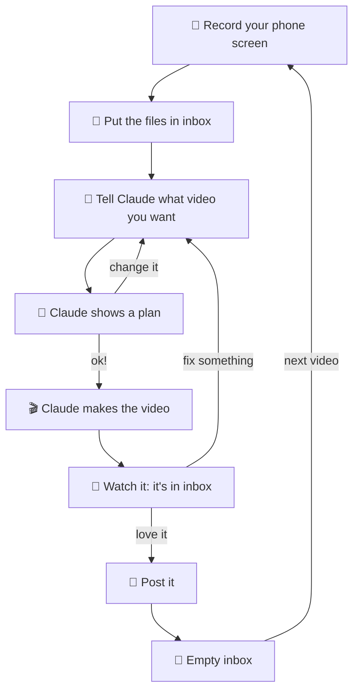

# 🎬 Claude Video Toolkit

**A video editor you talk to.** Put your phone screen recordings in a folder, tell Claude what video you want, and
Claude makes a ready-to-post TikTok, Reel or Short.

## ✨ What it does

- 🎬 **A video editor inside Claude.** You say what you want in normal words, and it edits the video for you.
- 📱 **It uses your real recordings.** People see your real app working. Nothing is fake.
- ✨ **It adds the pro stuff for you.** An iPhone frame, captions that pop up word by word with the voice, zoom-ins on
  important taps, sounds, music and a "download" screen at the end.
- 📂 **One folder does everything.** It's called `inbox`. You put your files in, and the finished video comes back out
  there.
- 🧾 **What goes in `inbox`.** 1–3 screen recordings from your phone. Extras if you want: a voice-over (MP3), or a
  video whose style you like, so Claude can copy its speed (not its content).
- 💬 **How you ask.** "Make a 20-second TikTok showing how to add a card. Files are in inbox." That's it.
- 📝 **Claude plans first.** It shows you what happens at each second. You say "ok" or change it, then it makes the
  video. Want a fix? Say "bigger text" and you get version 2.
- 🧹 **Next video.** Post it, then empty `inbox`. Every video's recipe is saved, so you can remake it later.
- 🅰️ **Empty `inbox`? It still works.** It can make text and animation videos, like tips, lists or big numbers, with
  no recordings at all.
- 🔗 **Saw a TikTok you love?** Send Claude the link. It learns why it works (the start, the speed, the sounds) and
  uses that in your next videos.

## 🗺️ How a video gets made



## 📂 What your `inbox` folder looks like

Before (you put these in):

```
inbox/
├── add_card.mov          ← a screen recording from your phone (1 to 3 of them)
├── search.mov            ← another one
├── voiceover.mp3         ← optional: a voice (made in ElevenLabs, or your own)
└── style_i_like.mp4      ← optional: a video whose speed you like
```

After (Claude puts these in):

```
inbox/
├── MyVideo_v1.mp4        ← your video, ready to post
└── MyVideo_v1.srt        ← the captions as a file (some apps let you upload it)
```

## 🛠️ Setup (one time, about 1 hour)

**You need:** a Mac · internet · 5 GB of free space · a Claude **Pro or Max** plan (the free plan doesn't include
Claude Code) · the GitHub invite from the owner of this repo (check your email and click **Accept**).

**How to follow the steps:** every grey box is something to copy. Paste it into Terminal and press **Enter**. Wait
until it finishes before you paste the next box.

### Step 1: Open Terminal

Press **⌘ Command + Space**, type `Terminal`, press **Enter**. A window with text opens: this is where you paste.

### Step 2: Install Homebrew (it installs apps for you)

```bash
/bin/bash -c "$(curl -fsSL https://raw.githubusercontent.com/Homebrew/install/HEAD/install.sh)"
```

- It asks for your Mac password. You won't see the letters while you type: that's normal. Press **Enter**.
- At the end it shows **Next steps** with 2 or 3 lines. Copy those lines, paste them, press **Enter**.

### Step 3: Log in to GitHub

```bash
brew install gh
```

```bash
gh auth login
```

Answer the questions with the arrow keys and **Enter**: **GitHub.com** → **HTTPS** → **Yes** → **Login with a web
browser**. It shows a code: copy it, press **Enter**, and paste the code in the browser page that opens.

### Step 4: Download the toolkit

```bash
gh repo clone pavanmulka/claude-video-toolkit ~/claude-video-toolkit
```

```bash
cd ~/claude-video-toolkit
```

### Step 5: Install everything else (one command)

```bash
./setup.sh
```

Get a snack 🍿. It installs the video engine, the fonts and the helpers. The first time can take 30–40 minutes. It is
finished when you see **setup done**.

### Step 6: Test it

```bash
./vtk render examples/demo.yaml --preview
```

```bash
open .work/demo/previews/demo_preview.mp4
```

A short video with "EVERY VIDEO IS A SPEC." plays? 🎉 Everything works.

### Step 7: Get Claude

1. Download the [Claude app for Mac](https://claude.ai/api/desktop/darwin/universal/dmg/latest/redirect), open it and
   drag it into **Applications**.
2. Open Claude and log in. Click the **Code** tab → **Local** → **Select folder**.
3. Pick the **claude-video-toolkit** folder (it's in your home folder, the one with the house icon 🏠).

Like Terminal better? Run `brew install --cask claude-code`, then `cd ~/claude-video-toolkit` and `claude`.

### Step 8: Tell Claude about your app

Type this to Claude (fill in the blanks):

> Set up my workspace. My app is called ___ and it helps people ___. I make videos for TikTok and Instagram.

Claude fills in your private `workspace` folder: your app, your colours, your style.

## 🔁 Every day

1. 📱 Record your phone screen doing the thing you want to show.
2. 📂 Open the `inbox` folder and drag your files in. (Finder → your home folder 🏠 → claude-video-toolkit → inbox)
3. 💬 Tell Claude what you want: *"New video. Files are in inbox. Show how to add a card, 20 seconds, for TikTok."*
4. 📝 Read the plan. Say "ok" or what to change.
5. 👀 Watch the video in `inbox`. Ask for fixes if you want ("bigger text", "cut the start").
6. 🚀 Post it. Then 🧹 empty `inbox` for tomorrow.

## 🆘 If something goes wrong

- **"command not found: brew"** → close Terminal and open it again. Still there? Do the **Next steps** lines from Step 2
  again.
- **Setup stopped with a red error** → run `./setup.sh` again (it continues where it stopped).
- **Anything else** → copy the error text, paste it to Claude and say *"fix this"*.

## 🔒 Your stuff stays yours

- `workspace/` keeps your app's info, your video recipes and your ideas.
- `inbox/` keeps your recordings and finished videos.
- Both stay on your Mac. They are never uploaded to this repo.

## 🤓 For the curious

Commands Claude uses (you can use them too):

```bash
./vtk inspect                        # what's in inbox (contact sheets, idle moments, iPhone model)
./vtk new my-video --template problem-payoff   # start a video from one of 13 formats (./vtk new --list)
./vtk render workspace/history/<date>_my-video/spec.yaml --preview
./vtk looks --render themes          # see every theme, text effect, mark, transition and caption style
./vtk learn <TikTok / YouTube / Instagram link>   # add a video to the trends knowledge base
./vtk ideas                          # your video ideas board
```

What's inside:

- iPhone frame drawn in code (real corner radius, Dynamic Island), 3D tilt entrances, zooms, speed ramps, freeze frames.
- 11 visual themes with moving backgrounds (glow stage, paper, grid, aurora...).
- Moving text: word by word, stamps, typewriter, highlighter, strike-and-replace, glass cards, text behind the phone.
- Drawn circles and arrows, and pop-out magnified parts of the real screen.
- Captions made from the voice-over, word by word, in 2026 styles.
- Voice effects (phone call, radio, airplane PA...), sound effects, music that gets quieter under the voice, the right
  loudness for each platform.
- Transitions (whip, zoom-through, slide...), loop endings, warnings when text sits under TikTok's buttons.
- Motion graphics (chat bubbles, counters, charts, end cards) made with Remotion.
- A/B versions of the first seconds, other sizes (1:1, 4:5, 16:9), a caption file, and a contact sheet after every
  video so Claude checks its own work.

The full manual (what Claude follows) is [CLAUDE.md](CLAUDE.md). Motion graphics use Remotion, which is free for
individuals and companies of up to 3 people (see its license).
